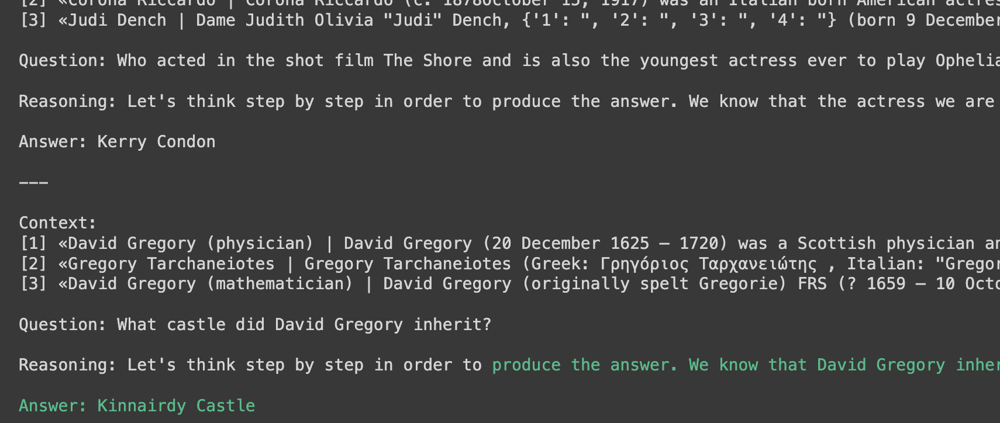

# Learning DSPy

Backronym: "Declarative Self-improving Language Programs, pythonically." Basically the PyTorch of foundation models.

Just one of the things I'm learning. https://github.com/hchiam/learning

TODO: see how the DSPy framework solves the fragility problem in LLM-based applications by replacing prompting with programming and compiling.

https://github.com/stanfordnlp/dspy

https://colab.research.google.com/github/stanfordnlp/dspy/blob/main/intro.ipynb

https://dspy-docs.vercel.app/docs/quick-start/minimal-example

https://dspy-docs.vercel.app/docs/category/dspy-building-blocks

https://dspy-docs.vercel.app/docs/cheatsheet

https://dspy-docs.vercel.app/docs/category/deep-dive

## Workflow

1. data
2. pipeline (program of interacting declarative modules and prompts)
3. validation logic
4. compile (to optimize LM prompts to your (1) data, (2) pipeline, and (3) validation, to solve the task)
5. iterate

## Data

- `trainset`

## Pipeline

### Prediction

- signature `class` = docstring + input + output (yes, DSPy can see the docstring)
- `generate_answer = dspy.Predict(YourSignatureClassHere)`
  - or `generate_answer = dspy.ChainOfThought(YourSignatureClassHere)`
- `prediction = generate_answer(question=dev_example.question)`
- `print(dev_example.question)`
- `print(prediction.rationale.split('.', 1)[1].strip())` if you used `dspy.ChainOfThought` (ignore the "produce the answer." part of the `rationale`)
- `print(prediction.answer)`
- `turbo.inspect_history(n=1)`

```py
# question -> answer
class BasicQA(dspy.Signature):
    """Answer questions with short factoid answers."""
    question = dspy.InputField()
    answer = dspy.OutputField(desc="often between 1 and 5 words")

generate_answer = dspy.ChainOfThought(BasicQA) # <- BasicQA
prediction = generate_answer(question=dev_example.question)
print(f"Question: {dev_example.question}")
print(f"Thought: {prediction.rationale.split('.', 1)[1].strip()}")
print(f"Predicted Answer: {prediction.answer}")
```

### Retrieval

- `retrieve = dspy.Retrieve(k=3)`
- `topK_passages = retrieve(dev_example.question).passages`

```py
# context, question -> answer
class GenerateAnswer(dspy.Signature):
    """Answer questions with short factoid answers."""
    context = dspy.InputField(desc="may contain relevant facts")
    question = dspy.InputField()
    answer = dspy.OutputField(desc="often between 1 and 5 words")

class RAG(dspy.Module):
    # __init__ defines submodules it needs:
    def __init__(self, num_passages=3):
        super().__init__()
        self.retrieve = dspy.Retrieve(k=num_passages)
        self.generate_answer = dspy.ChainOfThought(GenerateAnswer) # <- GenerateAnswer

    # forward defines control flow: ((question -> context) -> RAG) -> final_prediction
    def forward(self, question):
        context = self.retrieve(question).passages
        rag_cot_answer = self.generate_answer(context=context, question=question)
        final_prediction = dspy.Prediction(context=context, answer=rag_cot_answer.answer)
        return final_prediction
```

## Validation and Compilation

- use a "teleprompter" AKA optimizer/compiler via "prompting at a distance"

```py
from dspy.teleprompt import BootstrapFewShot

# validation: check answer is correct, and check context contains that answer.
def validate_context_and_answer(example, pred, trace=None):
    is_answer_correct = dspy.evaluate.answer_exact_match(example, pred)
    is_answer_in_context = dspy.evaluate.answer_passage_match(example, pred)
    return is_answer_correct and is_answer_in_context

teleprompter = BootstrapFewShot(metric=validate_context_and_answer)
compiled_rag = teleprompter.compile(RAG(), trainset=trainset) # <- RAG from earlier
```

```py
question = "What castle did David Gregory inherit?"

prediction = compiled_rag(question)

print(f"Question: {question}")
print(f"Retrieved Contexts (truncated): {[c[:200] + '...' for c in prediction.context]}")
print(f"Predicted Answer: {prediction.answer}")
```

```py
# inspect the last prompt for the LM:
turbo.inspect_history(n=1)
```



```py
for name, parameter in compiled_rag.named_predictors():
    print(name)
    print(parameter.demos[0])
    print()
```

### Evaluation of final prediction

```py
from dspy.evaluate.evaluate import Evaluate

# exact match:
metric = dspy.evaluate.answer_exact_match

# create evaluator:
evaluate_on_hotpotqa = Evaluate(
  devset=devset,
  num_threads=1,
  display_progress=True,
  display_table=5
)

# use evaluator: (prints out metric result and table of inputs/outputs/metric values)
evaluate_on_hotpotqa(compiled_rag, metric=metric) # <- compiled_rag from earlier
```

### Evaluation of RAG retrievals

```py
def retrieved_gold_passages(example, pred, trace=None):
    gold_titles = set(map(dspy.evaluate.normalize_text, example['gold_titles']))
    found_titles = set(map(dspy.evaluate.normalize_text, [c.split(' | ')[0] for c in pred.context]))
    retrieved_some_gold_titles = gold_titles.issubset(found_titles)
    return retrieved_some_gold_titles

compiled_rag_retrieval_score = evaluate_on_hotpotqa(compiled_rag, metric=retrieved_gold_passages)
```

Tip: if (predictions correct > retrievals correct) then LM likely relying on memorized knowledge and not on retrievals.

## Iterate

Tip: if (one search query isn't enough) then "multi-hop" queries:

- (Baleen and GoldEn are examples of multi-hop search systems)

```py
# context, question -> query
class GenerateSearchQuery(dspy.Signature):
    """Write a simple search query that will help answer a complex question."""
    context = dspy.InputField(desc="may contain relevant facts")
    # or context = GenerateAnswer.signature.context # to avoid duplicating desc # <- GenerateAnswer
    question = dspy.InputField()
    query = dspy.OutputField()


from dsp.utils import deduplicate

class SimplifiedBaleen(dspy.Module):
    # __init__ defines submodules it needs:
    def __init__(self, passages_per_hop=3, max_hops=2):
        super().__init__()
        self.generate_query = [dspy.ChainOfThought(GenerateSearchQuery) for _ in range(max_hops)] # <- GenerateSearchQuery (c, q -> q)
        self.retrieve = dspy.Retrieve(k=passages_per_hop)
        self.generate_answer = dspy.ChainOfThought(GenerateAnswer) # <- GenerateAnswer (c, q -> a)
        self.max_hops = max_hops

    # forward defines control flow: ((context + question) -> query -> passages) -> context -> RAG) -> final_prediction
    def forward(self, question):
        context = []

        for hop in range(self.max_hops):
            query = self.generate_query[hop](
              context=context,
              question=question
            ).query

            passages = self.retrieve(query).passages

            context = deduplicate(context + passages)

        mhs_cot_answer = self.generate_answer(
          context=context,
          question=question
        )

        final_prediction = dspy.Prediction(
          context=context,
          answer=mhs_cot_answer.answer
        )
        return final_prediction
```

```py
# uncompiled predictor = zero-shot
uncompiled_baleen = SimplifiedBaleen()
prediction = uncompiled_baleen(question)

print(f"Question: {question}")
print(f"Retrieved Contexts (truncated): {[c[:200] + '...' for c in prediction.context]}")
print(f"Predicted Answer: {prediction.answer}")
```

### Validate, Compile, and Evaluate this Iteration

```py
# to validate:

def validate_context_and_answer_and_hops(example, prediction, trace=None):
    # prediction answer matches gold answer:
    if not dspy.evaluate.answer_exact_match(example, prediction): return False

    # prediction context contains gold answer:
    if not dspy.evaluate.answer_passage_match(example, prediction): return False

    hops = [example.question] + [outputs.query for *_, outputs in trace if 'query' in outputs]

    # not have a rambling hop query > 100 characters:
    if max([len(h) for h in hops]) > 100: return False

    # not have any hop query over 80% matching any other hop query:
    if any(dspy.evaluate.answer_exact_match_str(hops[idx], hops[:idx], frac=0.8) for idx in range(2, len(hops))): return False

    # otherwise good:
    return True
```

```py
# to compile:

# use validation function
# to create basic BootstrapFewShot teleprompter/optimizer
# for this minimal example:
teleprompter = BootstrapFewShot(metric=validate_context_and_answer_and_hops) # <- validate_context_and_answer_and_hops

# COMPILED predictor using the teleprompter/optimizer:
compiled_baleen = teleprompter.compile(
    SimplifiedBaleen(),
    teacher=SimplifiedBaleen(passages_per_hop=2),
    trainset=trainset
)
```

```py
# to evaluate:

# (un)compile RAG vs uncompiled Baleen vs compiled Baleen:
compiled_rag_retrieval_score = evaluate_on_hotpotqa(compiled_rag, metric=retrieved_gold_passages)
# 26%
uncompiled_baleen_retrieval_score = evaluate_on_hotpotqa(uncompiled_baleen, metric=gold_passages_retrieved)
# 36%
compiled_baleen_retrieval_score = evaluate_on_hotpotqa(compiled_baleen, metric=gold_passages_retrieved)
# 60%
```

```py
# example output:
compiled_baleen("How many storeys are in the castle that David Gregory inherited?")
turbo.inspect_history(n=3)
```

<details>

<summary>example output:</summary>

```sh


Write a simple search query that will help answer a complex question.

---

Follow the following format.

Context: may contain relevant facts

Question: ${question}

Reasoning: Let's think step by step in order to ${produce the query}. We ...

Query: ${query}

---

Context: N/A

Question: In what year was the club founded that played Manchester City in the 1972 FA Charity Shield

Reasoning: Let's think step by step in order to produce the query. We know that the FA Charity Shield is an annual football match played in England between the winners of the previous season's Premier League and FA Cup. In this case, we are looking for the year when Manchester City played against a specific club in the 1972 FA Charity Shield. To find this information, we can search for the history of the FA Charity Shield and the teams that participated in the 1972 edition.

Query: "History of FA Charity Shield 1972"

---

Context: N/A

Question: Which is taller, the Empire State Building or the Bank of America Tower?

Reasoning: Let's think step by step in order to produce the query. We need to find the heights of both buildings and compare them.

Query: "height of Empire State Building" OR "height of Bank of America Tower"

---

Context: N/A

Question: Who is older, Aleksandr Danilovich Aleksandrov or Anatoly Fomenko?

Reasoning: Let's think step by step in order to produce the query. We can search for the birth dates of both Aleksandr Danilovich Aleksandrov and Anatoly Fomenko and compare them to determine who is older.

Query: "Birth date Aleksandr Danilovich Aleksandrov" "Birth date Anatoly Fomenko"

---

Context: N/A

Question: How many storeys are in the castle that David Gregory inherited?

Reasoning: Let's think step by step in order to produce the query. We need to find information about the castle that David Gregory inherited and determine the number of storeys it has.

Query: "Castle inherited by David Gregory number of storeys"


Write a simple search query that will help answer a complex question.

---

Follow the following format.

Context: may contain relevant facts

Question: ${question}

Reasoning: Let's think step by step in order to ${produce the query}. We ...

Query: ${query}

---

Context:
[1] «1972 FA Charity Shield | The 1972 FA Charity Shield was contested between Manchester City and Aston Villa.»
[2] «1971 FA Charity Shield | The 1971 FA Charity Shield was a football match between Leicester City and Liverpool at Filbert Street on Saturday 7 August 1971.»

Question: In what year was the club founded that played Manchester City in the 1972 FA Charity Shield

Reasoning: Let's think step by step in order to produce the query. We know that the 1972 FA Charity Shield was contested between Manchester City and Aston Villa. To find out the year the club founded that played against Manchester City, we need to search for the founding year of Aston Villa.

Query: "Aston Villa founding year"

---

Context:
[1] «Empire State Building | The Empire State Building is a 102-story skyscraper located on Fifth Avenue between West 33rd and 34th Streets in Midtown, Manhattan, New York City. It has a roof height of 1,250 feet (381 m), and with its antenna included, it stands a total of 1454 ft tall. Its name is derived from the nickname for New York, the Empire State.»
[2] «Bank of America Plaza (Atlanta) | Bank of America Plaza is a skyscraper located in between Midtown Atlanta and Downtown Atlanta. At 312 m , the tower is the 96th-tallest building in the world. It is the 14th tallest building in the U.S., the tallest building in Georgia and the tallest building in any U.S. state capital, overtaking the 250 m (820 ft), 50 story One Atlantic Center in height, which previously held the record as Georgia's tallest building. It has 55 stories of office space and was completed in 1992, when it was called NationsBank Plaza. Originally intended to be the headquarters for Citizens & Southern National Bank (which merged with Sovran Bank during construction), it became NationsBank's property following its formation in the 1991 hostile takeover of C&S/Sovran by NCNB.»

Question: Which is taller, the Empire State Building or the Bank of America Tower?

Reasoning: Let's think step by step in order to answer the question. We know that the Empire State Building has a roof height of 1,250 feet and a total height of 1,454 feet including its antenna. On the other hand, the Bank of America Plaza in Atlanta is 312 meters tall. To compare the heights of the two buildings, we need to convert the height of the Bank of America Plaza from meters to feet.

Query: "Convert 312 meters to feet"

---

Context:
[1] «Aleksandr Danilovich Aleksandrov | Aleksandr Danilovich Aleksandrov (Russian: Алекса́ндр Дани́лович Алекса́ндров , alternative transliterations: "Alexandr" or "Alexander" (first name), and "Alexandrov" (last name)) (August 4, 1912 – July 27, 1999), was a Soviet/Russian mathematician, physicist, philosopher and mountaineer.»
[2] «Aleksandr Pavlovich Aleksandrov | Aleksandr Pavlovich Aleksandrov (Russian: Александр Павлович Александров ; born February 20, 1943) is a former Soviet cosmonaut and twice Hero of the Soviet Union (November 23, 1983 and December 29, 1987).»

Question: Who is older, Aleksandr Danilovich Aleksandrov or Anatoly Fomenko?

Reasoning: Let's think step by step in order to produce the query. We know that Aleksandr Danilovich Aleksandrov was born on August 4, 1912, but we don't have information about Anatoly Fomenko's birthdate. To find out who is older, we need to compare their birthdates.

Query: "Anatoly Fomenko birthdate"

---

Context:
[1] «David Gregory (physician) | David Gregory (20 December 1625 – 1720) was a Scottish physician and inventor. His surname is sometimes spelt as Gregorie, the original Scottish spelling. He inherited Kinnairdy Castle in 1664. Three of his twenty-nine children became mathematics professors. He is credited with inventing a military cannon that Isaac Newton described as "being destructive to the human species". Copies and details of the model no longer exist. Gregory's use of a barometer to predict farming-related weather conditions led him to be accused of witchcraft by Presbyterian ministers from Aberdeen, although he was never convicted.»
[2] «Gregory Tarchaneiotes | Gregory Tarchaneiotes (Greek: Γρηγόριος Ταρχανειώτης , Italian: "Gregorio Tracanioto" or "Tracamoto" ) was a "protospatharius" and the long-reigning catepan of Italy from 998 to 1006. In December 999, and again on February 2, 1002, he reinstituted and confirmed the possessions of the abbey and monks of Monte Cassino in Ascoli. In 1004, he fortified and expanded the castle of Dragonara on the Fortore. He gave it three circular towers and one square one. He also strengthened Lucera.»
[3] «Gregory Parsloe-Parsloe | Sir Gregory Parsloe-Parsloe, 7th Baronet is a fictional character from the Blandings stories of P. G. Wodehouse. The seventh Baronet, who resides at Matchingham Hall, he is the son of the Very Reverend Dean Parsloe-Parsloe and is the rival and enemy of Lord Emsworth, master of Blandings Castle.»

Question: How many storeys are in the castle that David Gregory inherited?

Reasoning: Let's think step by step in order to produce the query. We know that David Gregory inherited Kinnairdy Castle and that he had three of his twenty-nine children become mathematics professors. To find out how many storeys are in the castle, we need to search for information about Kinnairdy Castle.

Query: "Kinnairdy Castle number of storeys"


Answer questions with short factoid answers.

---

Question: The Organisation that allows a community to influence their operation or use and to enjoy the benefits arisingwas founded in what year?
Answer: 2010

Question: On the coast of what ocean is the birthplace of Diogal Sakho?
Answer: Atlantic

Question: Which company distributed this 1977 American animated film produced by Walt Disney Productions for which Sherman Brothers wrote songs?
Answer: Buena Vista Distribution

Question: Which magazine has published articles by Scott Shaw, Tae Kwon Do Times or Southwest Art?
Answer: Tae Kwon Do Times

Question: Which American actress who made their film debut in the 1995 teen drama "Kids" was the co-founder of Voto Latino?
Answer: Rosario Dawson

Question: Who acted in the shot film The Shore and is also the youngest actress ever to play Ophelia in a Royal Shakespeare Company production of "Hamlet." ?
Answer: Kerry Condon

Question: which American actor was Candace Kita guest starred with
Answer: Bill Murray

Question: "Everything Has Changed" is a song from an album released under which record label ?
Answer: Big Machine Records

Question: Tombstone stared an actor born May 17, 1955 known as who?
Answer: Bill Paxton

Question: Which of these publications was most recently published, Who Put the Bomp or Self?
Answer: Self

Question: What is the code name for the German offensive that started this Second World War engagement on the Eastern Front (a few hundred kilometers from Moscow) between Soviet and German forces, which included 102nd Infantry Division?
Answer: Operation Citadel

Question: Samantha Cristoforetti and Mark Shuttleworth are both best known for being first in their field to go where?
Answer: space

Question: Having the combination of excellent foot speed and bat speed helped Eric Davis, create what kind of outfield for the Los Angeles Dodgers?
Answer: "Outfield of Dreams"

---

Follow the following format.

Context: may contain relevant facts

Question: ${question}

Reasoning: Let's think step by step in order to ${produce the answer}. We ...

Answer: often between 1 and 5 words

---

Context:
[1] «1972 FA Charity Shield | The 1972 FA Charity Shield was contested between Manchester City and Aston Villa.»
[2] «1971 FA Charity Shield | The 1971 FA Charity Shield was a football match between Leicester City and Liverpool at Filbert Street on Saturday 7 August 1971.»
[3] «1896–97 Aston Villa F.C. season | The 1896-87 season was Aston Villa's ninth season in the Football League since being one of its 12 founding members in 1888.»
[4] «List of Aston Villa F.C. seasons | This is a list of seasons played by Aston Villa Football Club in English and European football, from 1879 (the year of the club's first FA Cup entry) to the most recent completed season. Aston Villa football club was founded in March, 1874, by members of the Villa Cross Wesleyan Chapel in Aston. Throughout the 1870s Aston Villa played a small amount of games. At least one game, against Aston Brook St Mary's was played with one half under Rugby rules and the other under football rules. In the 1880s the game became more formalised and in 1888, William McGregor formed the Football League with 11 other clubs.»

Question: In what year was the club founded that played Manchester City in the 1972 FA Charity Shield

Reasoning: Let's think step by step in order to produce the answer. We know that the 1972 FA Charity Shield was contested between Manchester City and Aston Villa. According to the context, Aston Villa Football Club was founded in March, 1874.

Answer: 1874

---

Context:
[1] «Empire State Building | The Empire State Building is a 102-story skyscraper located on Fifth Avenue between West 33rd and 34th Streets in Midtown, Manhattan, New York City. It has a roof height of 1,250 feet (381 m), and with its antenna included, it stands a total of 1454 ft tall. Its name is derived from the nickname for New York, the Empire State.»
[2] «Bank of America Plaza (Atlanta) | Bank of America Plaza is a skyscraper located in between Midtown Atlanta and Downtown Atlanta. At 312 m , the tower is the 96th-tallest building in the world. It is the 14th tallest building in the U.S., the tallest building in Georgia and the tallest building in any U.S. state capital, overtaking the 250 m (820 ft), 50 story One Atlantic Center in height, which previously held the record as Georgia's tallest building. It has 55 stories of office space and was completed in 1992, when it was called NationsBank Plaza. Originally intended to be the headquarters for Citizens & Southern National Bank (which merged with Sovran Bank during construction), it became NationsBank's property following its formation in the 1991 hostile takeover of C&S/Sovran by NCNB.»
[3] «Foot (unit) | The foot ( feet; abbreviation: ft; symbol: ′, the prime symbol) is a unit of length in the imperial and US customary systems of measurement. Since 1959, both units have been defined by international agreement as equivalent to 0.3048 meters exactly. In both systems, the foot comprises 12 inches and three feet compose a yard.»
[4] «Pentameter | Pentameter (from Greek: πεντάμετρος - 'measuring five (feet)') is a poetic meter. А poem is said to be written in a particular pentameter when the lines of the poem have the length of five feet, where 'foot' is a combination of a particular number (1 or 2) of unstressed (or weak) syllables and a stressed (or strong) syllable. Depending on the pattern of feet, pentameter can be iambic (one of three two-syllable meters alongside trochaic and spondaic) or dactylic (one of two three-syllable meters alongside anapestic) (see links below).»

Question: Which is taller, the Empire State Building or the Bank of America Tower?

Reasoning: Let's think step by step in order to produce the answer. We know that the Empire State Building has a roof height of 1,250 feet and with its antenna included, it stands a total of 1,454 feet tall. On the other hand, the Bank of America Plaza in Atlanta is 312 meters tall, which is approximately 1,024 feet. Therefore, the Empire State Building is taller than the Bank of America Plaza.

Answer: Empire State Building

---

Context:
[1] «Aleksandr Danilovich Aleksandrov | Aleksandr Danilovich Aleksandrov (Russian: Алекса́ндр Дани́лович Алекса́ндров , alternative transliterations: "Alexandr" or "Alexander" (first name), and "Alexandrov" (last name)) (August 4, 1912 – July 27, 1999), was a Soviet/Russian mathematician, physicist, philosopher and mountaineer.»
[2] «Aleksandr Pavlovich Aleksandrov | Aleksandr Pavlovich Aleksandrov (Russian: Александр Павлович Александров ; born February 20, 1943) is a former Soviet cosmonaut and twice Hero of the Soviet Union (November 23, 1983 and December 29, 1987).»
[3] «Anatoly Fomenko | Anatoly Timofeevich Fomenko (Russian: Анато́лий Тимофе́евич Фоме́нко ) (born 13 March 1945 in Stalino, USSR) is a Soviet and Russian mathematician, professor at Moscow State University, well known as a topologist, and a member of the Russian Academy of Sciences. He is author of a pseudoscientific theory known as New Chronology. He is also a member of the Russian Academy of Natural Sciences (1991).»
[4] «Semyon Fomin | Semyon Anatolyevich Fomin (Russian: Семён Анатольевич Фомин ; born 10 January 1989) is a Russian professional footballer. He plays as a midfielder for FC Luch-Energiya Vladivostok.»

Question: Who is older, Aleksandr Danilovich Aleksandrov or Anatoly Fomenko?

Reasoning: Let's think step by step in order to produce the answer. We know that Aleksandr Danilovich Aleksandrov was born on August 4, 1912, and Anatoly Fomenko was born on March 13, 1945. Therefore, Aleksandr Danilovich Aleksandrov is older.

Answer: Aleksandr Danilovich Aleksandrov

---

Context:
[1] «David Gregory (physician) | David Gregory (20 December 1625 – 1720) was a Scottish physician and inventor. His surname is sometimes spelt as Gregorie, the original Scottish spelling. He inherited Kinnairdy Castle in 1664. Three of his twenty-nine children became mathematics professors. He is credited with inventing a military cannon that Isaac Newton described as "being destructive to the human species". Copies and details of the model no longer exist. Gregory's use of a barometer to predict farming-related weather conditions led him to be accused of witchcraft by Presbyterian ministers from Aberdeen, although he was never convicted.»
[2] «Gregory Tarchaneiotes | Gregory Tarchaneiotes (Greek: Γρηγόριος Ταρχανειώτης , Italian: "Gregorio Tracanioto" or "Tracamoto" ) was a "protospatharius" and the long-reigning catepan of Italy from 998 to 1006. In December 999, and again on February 2, 1002, he reinstituted and confirmed the possessions of the abbey and monks of Monte Cassino in Ascoli. In 1004, he fortified and expanded the castle of Dragonara on the Fortore. He gave it three circular towers and one square one. He also strengthened Lucera.»
[3] «Gregory Parsloe-Parsloe | Sir Gregory Parsloe-Parsloe, 7th Baronet is a fictional character from the Blandings stories of P. G. Wodehouse. The seventh Baronet, who resides at Matchingham Hall, he is the son of the Very Reverend Dean Parsloe-Parsloe and is the rival and enemy of Lord Emsworth, master of Blandings Castle.»
[4] «Kinnairdy Castle | Kinnairdy Castle is a tower house, having five storeys and a garret, two miles south of Aberchirder, Aberdeenshire, Scotland. The alternative name is Old Kinnairdy.»
[5] «Kinnaird Head | Kinnaird Head (Scottish Gaelic: "An Ceann Àrd" , "high headland") is a headland projecting into the North Sea, within the town of Fraserburgh, Aberdeenshire on the east coast of Scotland. The 16th-century Kinnaird Castle was converted in 1787 for use as the Kinnaird Head Lighthouse, the first lighthouse in Scotland to be lit by the Commissioners of Northern Lights. Kinnaird Castle and the nearby Winetower were described by W. Douglas Simpson as two of the nine castles of the Knuckle, referring to the rocky headland of north-east Aberdeenshire. Both buildings are category A listed buildings.»
[6] «Kinnaird Castle, Brechin | Kinnaird Castle is a 15th-century castle in Angus, Scotland. The castle has been home to the Carnegie family, the Earl of Southesk, for more than 600 years.»

Question: How many storeys are in the castle that David Gregory inherited?

Reasoning: Let's think step by step in order to produce the answer. We know that David Gregory inherited Kinnairdy Castle. According to the context, Kinnairdy Castle is a tower house with five storeys and a garret.

Answer: Five
```

</details>

Further ideas:

- use other sub-modules (summarize after retrieve?)
- break out of multi-hop loop if found all info need?
- better validation (another DSPy program to evaluate, instead of string matching?)
- different teleprompter/optimizer?
- add more and/or better training examples?
- as a last resort, tweak signature descriptions? (basically prompt engineering)
